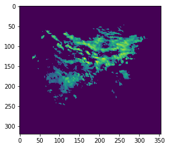
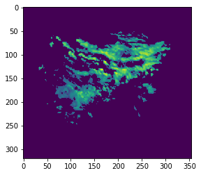
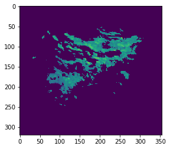

# Autoregression.Pytorch

AR(2) auto regression model.

## Installation
`git clone https://github.com/Fangyh09/Autoregression.Pytorch.git`
## Usage
```
python main.py
```
## Screenshot
### input img0, img1, img2




### output img3



## TODOs
* Add fft decompose
* Add optical flow

## History

## Credits
Thanks @ssim-pytorch, @pysteps
