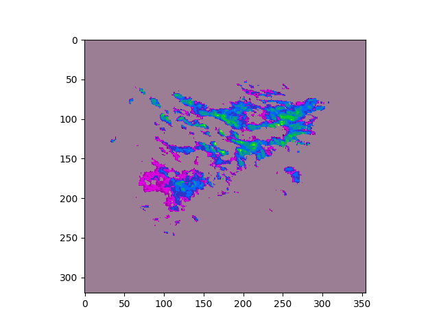

# Autoregression.Pytorch

AR(2) auto regression model.

Support:
* AR(2)
* FFT decompose


## Installation
`git clone https://github.com/Fangyh09/Autoregression.Pytorch.git`
## Usage
```
python main.py
```
## Screenshot-FFT
### input img0, img1, img2
<!-- 

 -->


### output img3
<!--  -->


## Screenshot-NoFFT
### input img0, img1, img2


### output img3



## TODOs
* [x] Add fft decompose
* [ ] Add optical flow

## History

## Credits
Some codes are from @pysteps.
Thanks @ssim-pytorch, @pysteps
